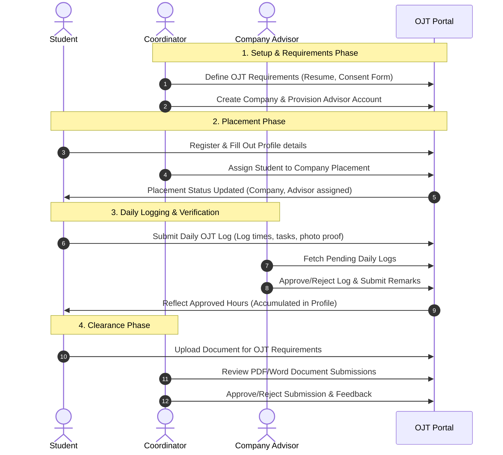
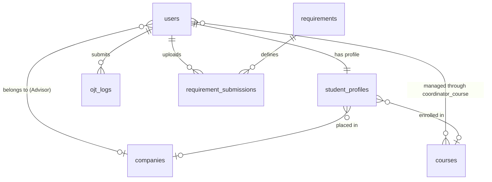

# System Design Specification: Internship Application and Tracking System

This document outlines the detailed architecture, system design, processes, and database layout of the **Internship Application and Tracking System (OJT Portal)** built on the Laravel framework.

---

## A. System of Rules (Business Logic Rules)

The system operates under a strict role-based policy system to maintain integrity, prevent timesheet fraud, and streamline workflow:

1. **Role-Based Access Control (RBAC):**
   * Users are assigned one of four roles: `Admin`, `Coordinator`, `Advisor` (Company Supervisor), or `Student`.
   * Cross-role route access is prevented via custom middleware (e.g., `role:Admin`, `role:Advisor`, `role:Admin,coordinator`).
   
2. **Placement Rules:**
   * A `Student` cannot log daily hours or submit activity updates until they are formally assigned to a partner `Company` placement by their managing `Coordinator`.
   * A `Student` cannot log logs unless their assigned `Company` has at least one registered supervisor/advisor (`Advisor`) account.
   
3. **Daily Log Reporting Rules:**
   * **Date Rule:** Log submissions must be made for the current date or historical dates (`before_or_equal:today`). Future dates are rejected.
   * **Duplicate Prevention:** A student can submit only one log entry per date.
   * **Shift Limits:** Submissions check sequence validity (AM clock-out must be after AM clock-in; PM clock-in must be after AM clock-out; PM clock-out must be after PM clock-in).
   * **Evidence Requirement:** A photo upload (e.g., workspace selfie or logbook photo) is required to authenticate the entry.
   * **Hour Conversion Format:** Hours are stored in a human decimal structure (e.g., 8 hours and 30 minutes is saved exactly as `8.30`, and 4 hours and 1 minute is `4.01`).

4. **Log Evaluation & Locking Policy:**
   * Newly submitted logs are labeled as `Pending`.
   * While a log is `Pending`, the Student can delete or edit it.
   * Once the `Advisor` (Company Supervisor) approves or rejects a log, the entry is locked. Deletion and editing by the student are blocked.
   
5. **Academic Boundary Rules:**
   * Coordinators are assigned to manage specific `Courses` (departments). A Coordinator can only view, place, and approve requirement documents for students who belong to the departments they manage.

---

## B. Record List

The physical database tracks the following records (tables) to maintain the system state:

| Entity / Record | Database Table | Key Attributes | Purpose |
| :--- | :--- | :--- | :--- |
| **User Account** | `users` | `id`, `email`, `password`, `role`, `company_id` | Core authentication record for all user types. |
| **Student Profile** | `student_profiles` | `id`, `user_id`, `first_name`, `middle_name`, `last_name`, `course`, `required_hours`, `supervisor_id`, `company_id` | Extended demographic and placement data for students. |
| **Academic Course** | `courses` | `id`, `course_name`, `description` | Standardized curriculum names (e.g., BSIT, BSCS) managed by coordinators. |
| **Company Profile** | `companies` | `id`, `name`, `address`, `contact_email`, `contact_number` | Host training establishment information. |
| **Internship Placement** | `internships` | `id`, `student_id`, `company_id`, `advisor_id`, `start_date`, `end_date`, `status` | Formally logs placement periods and details. |
| **OJT Daily Log** | `ojt_logs` | `id`, `user_id`, `log_date`, `morning_in`, `morning_out`, `afternoon_in`, `afternoon_out`, `hours_rendered`, `tasks_performed`, `photo_path`, `status`, `remarks`, `has_overtime`, `ot_duration` | Daily time logs, task summaries, and supervisor approval logs. |
| **OJT Requirement** | `requirements` | `id`, `title`, `description`, `template_path` | Checklist templates (e.g., MOA, Resume) defined by coordinators. |
| **Requirement Submission** | `requirement_submissions` | `id`, `requirement_id`, `user_id`, `file_path`, `status`, `remarks` | Student file uploads and evaluation trails. |
| **Shift/Attendance Log** | `shift_logs` | `id`, `user_id`, `clock_in`, `clock_out`, `type`, `location` | Raw attendance punches for geolocation or shift tracking. |
| **Coordinator Assignment** | `coordinator_course` | `id`, `user_id`, `course_id` | Pivot table mapping academic coordinators to the courses they manage. |

---

## C. Process Specification

The system processes execute through the following workflows:



### Key Transaction Specifications:
1. **Log Rendering Calculation:** 
   * Input: `morning_in`, `morning_out`, `afternoon_in`, `afternoon_out`, `ot_clock_in`, `ot_clock_out`.
   * Logic: Computes time differences in minutes for the morning shift, afternoon shift, and overtime. Add shifts, convert to fractional representation (Hours = Floor(Minutes / 60), Remaining Minutes = Minutes % 60), format string as `%d.%02d` (e.g. `8.30`), and save.
2. **Supervisor Welcome Flow:**
   * When the Coordinator registers a supervisor, the system creates a User with role `Advisor`, generates a secure notification with the plaintext password, and sends it to the advisor's email address.

---

## D. Functional Requirements

### 1. Student Portal
* **FR-ST-01:** Authenticate and register profiles.
* **FR-ST-02:** Edit personal profile and input academic/contact details.
* **FR-ST-03:** View assigned company, supervisor details, and target required OJT hours.
* **FR-ST-04:** Record daily OJT shift entries including AM/PM/OT hours, activity description, and upload photo attachments.
* **FR-ST-05:** Delete pending daily logs.
* **FR-ST-06:** View/Download coordinator requirement templates.
* **FR-ST-07:** Upload requirement files (PDF/Doc) for evaluation.
* **FR-ST-08:** View real-time progress of approved hours versus remaining hours.

### 2. Advisor (Supervisor) Portal
* **FR-AD-01:** View dashboard metrics (Total active interns, today's clocked-in interns, pending review hours).
* **FR-AD-02:** Access student profiles, courses, and attendance logs.
* **FR-AD-03:** Access a dynamic calendar displaying intern shift logs and attendance histories.
* **FR-AD-04:** Approve or reject daily logs with evaluation comments/remarks.
* **FR-AD-05:** View the leaderboard of interns ranked by total hours rendered.

### 3. Coordinator Portal
* **FR-CO-01:** Manage (Create/Read/Update/Delete) partner companies.
* **FR-CO-02:** Provision Advisor/Supervisor accounts mapped to specific companies.
* **FR-CO-03:** Assign student profiles to companies (student placement).
* **FR-CO-04:** Create/Delete OJT requirement templates.
* **FR-CO-05:** Review and Approve/Reject student requirement submissions.
* **FR-CO-06:** View global reports, student listings, and leaderboard metrics.
* **FR-CO-07:** Create/Edit/Delete Course listings.

### 4. Admin Portal (Super Admin / Dean)
* **FR-AM-01:** View all registered coordinators.
* **FR-AM-02:** Create coordinator accounts and assign them to specific academic courses (departments).
* **FR-AM-03:** Detach courses and delete coordinator accounts.

---

## E. Program Hierarchy

The system follows the standard Laravel MVC architectural directory structure:

```
app/
├── Http/
│   ├── Controllers/
│   │   ├── Auth/
│   │   │   ├── LoginController.php
│   │   │   └── RegisterController.php
│   │   ├── Student/
│   │   │   ├── DashboardController.php
│   │   │   ├── OjtLogController.php
│   │   │   ├── ProfileController.php
│   │   │   └── StudentRequirementController.php
│   │   ├── Coordinator/
│   │   │   ├── CompanyController.php
│   │   │   ├── CoordinatorRequirementController.php
│   │   │   ├── CoordinatorManagerController.php
│   │   │   ├── CourseController.php
│   │   │   ├── StudentPlacementController.php
│   │   │   └── DashboardController.php
│   │   └── Supervisor/
│   │       ├── DashboardController.php
│   │       └── InternsController.php
│   └── Middleware/
│       └── EnsureUserHasRole.php (Role check)
└── Models/
    ├── User.php
    ├── StudentProfile.php
    ├── Company.php
    ├── Course.php
    ├── Internship.php
    ├── OjtLog.php
    ├── Requirement.php
    ├── RequirementSubmission.php
    └── ShiftLog.php
resources/
└── views/
    ├── auth/ (login, register templates)
    ├── components/ (layouts, modals, form inputs)
    ├── student/ (dashboard, profile, logs, requirements)
    ├── coordinator/ (companies, courses, requirements, students, reports)
    └── supervisor/ (dashboard, approvals, attendance, leaderboard)
```

---

## F. Database Design

### 1. Entity Relationship Schema (Logical representation)



### 2. Table Schemas

#### users Table
* **id:** bigint (Primary Key, Auto Increment)
* **email:** varchar(255) (Unique)
* **password:** varchar(255)
* **role:** enum('Admin', 'Coordinator', 'Advisor', 'Student')
* **company_id:** bigint (Foreign Key referencing `companies.id`, Nullable)
* **timestamps:** datetime

#### student_profiles Table
* **id:** bigint (Primary Key, Auto Increment)
* **user_id:** bigint (Foreign Key referencing `users.id`, Cascade Delete)
* **first_name:** varchar(255)
* **middle_name:** varchar(255) (Nullable)
* **last_name:** varchar(255)
* **course:** varchar(255) (Academic course name)
* **required_hours:** integer (Default target, e.g., 486)
* **company_id:** bigint (Foreign Key referencing `companies.id`, Nullable)
* **supervisor_id:** bigint (Foreign Key referencing `users.id`, Nullable)
* **timestamps:** datetime

#### companies Table
* **id:** bigint (Primary Key, Auto Increment)
* **name:** varchar(255)
* **address:** text (Nullable)
* **contact_email:** varchar(255) (Nullable)
* **contact_number:** varchar(255) (Nullable)
* **timestamps:** datetime

#### ojt_logs Table
* **id:** bigint (Primary Key, Auto Increment)
* **user_id:** bigint (Foreign Key referencing `users.id`)
* **log_date:** date
* **morning_in:** time (Nullable)
* **morning_out:** time (Nullable)
* **afternoon_in:** time (Nullable)
* **afternoon_out:** time (Nullable)
* **ot_clock_in:** time (Nullable)
* **ot_clock_out:** time (Nullable)
* **ot_duration:** decimal(5,2) (Decimal representation)
* **hours_rendered:** decimal(5,2)
* **tasks_performed:** text
* **photo_path:** varchar(255) (Evidence file path)
* **status:** enum('Pending', 'Approved', 'Rejected') (Default: 'Pending')
* **remarks:** text (Nullable, review comments)
* **has_overtime:** boolean (Default: false)
* **timestamps:** datetime

#### requirements Table
* **id:** bigint (Primary Key, Auto Increment)
* **title:** varchar(255)
* **description:** text (Nullable)
* **template_path:** varchar(255) (Nullable, downloadable PDF/Word templates)
* **timestamps:** datetime

#### requirement_submissions Table
* **id:** bigint (Primary Key, Auto Increment)
* **requirement_id:** bigint (Foreign Key referencing `requirements.id`, Cascade Delete)
* **user_id:** bigint (Foreign Key referencing `users.id`, Cascade Delete)
* **file_path:** varchar(255)
* **status:** enum('Pending', 'Approved', 'Rejected') (Default: 'Pending')
* **remarks:** text (Nullable)
* **timestamps:** datetime

---

## G. Cost-Benefit Analysis

A comparison of transitioning from manual, paper-based tracking sheets to the digital OJT Portal:

### 1. Cost Projection (Estimated Annual Expenditure)
* **Development/Deployment Costs:** Minimal (open-source stack: Laravel, Tailwind CSS, MySQL, hosted on standard institutional servers).
* **Hosting & Database Storage:** $120–$250/year (for standard VPS plus AWS S3 object storage for compressed log evidence photos/documents).
* **Maintenance & Admin Overhead:** Approximately 4 hours of IT department maintenance per month (backups, security patches).
* **Training Cost:** Virtually $0 (intuitive, mobile-ready layout requiring only a quick student/supervisor instructional guide).

### 2. Tangible & Intangible Benefits
* **Administrative Time Savings:** Eliminates the manual collection, computation, and auditing of printed logbooks. Coordinators save roughly **80% of administrative overhead** previously spent verifying signatures.
* **Reduction in Timesheet Fraud:** Mandatory photo upload and supervisor dashboard logs prevent students from fabricating hours or backdating timesheets.
* **Accuracy:** Automates decimal calculations of hours rendered, eliminating calculation errors from paper timesheets.
* **Audit Readiness:** Student files, logs, and advisor approvals are stored digitally, generating instant exportable progress reports for accreditation boards.

---

## H. User Interface Design

The UI is built with a clean, high-performance, and mobile-friendly design language using Vanilla CSS styling:

1. **Grid-Based Dashboards:**
   * Cards show highlighted key statistics (e.g., Progress bars of completed vs. target hours, active count of pending logs, number of active interns).
   
2. **Log Submission Panel:**
   * Easy-to-use form field groups separating morning shifts, afternoon shifts, and overtime shifts.
   * Simple file picker for uploading and previewing photo attachments prior to submission.

3. **Supervisor Calendar View:**
   * A full-width monthly/weekly calendar rendering daily logs. Logs are color-coded (Green for approved, Yellow for pending, Red for rejected) to allow supervisors to visually track attendance patterns at a glance.

4. **Document Manager Interface:**
   * Table display of requirements indicating templates, upload status, feedback comments, and badge indicators showing status (`Pending`, `Approved`, `Rejected`).
